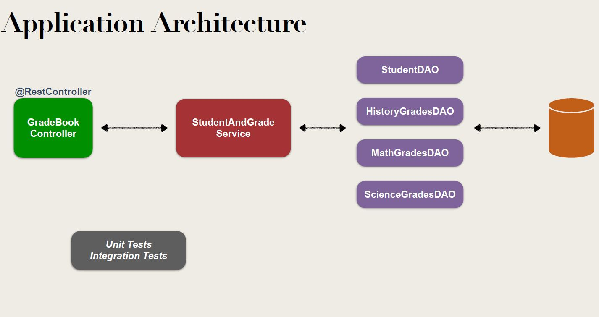
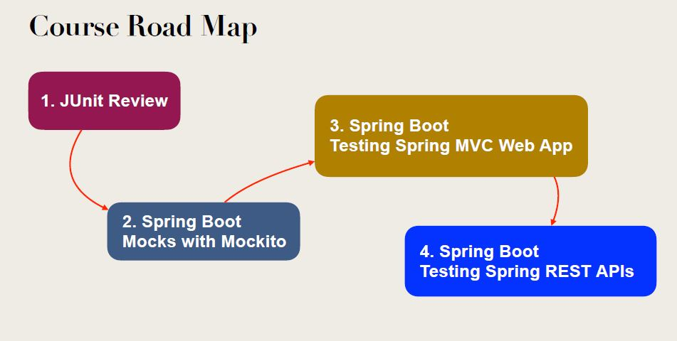
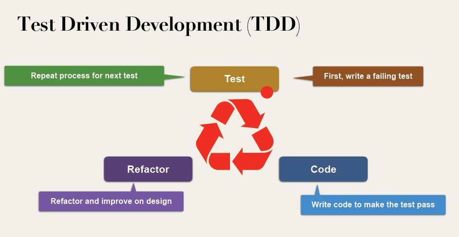

<h1> Study of Spring Boot Unit Testing with JUnit, Mockito and MockMvc </h1>  

<h2>Description</h2>

Explore the architecture of the Spring Boot testing framework and write integration tests
Develop unit tests with JUnit 5 and supporting JUnit Assertions
Mock Spring container dependencies using Mockito
Apply Test Driven Development (TDD) using JUnit 5, Mockito and Spring Boot
Test Spring Boot MVC web applications with MockMvc and ModelView assertions
Test Spring Boot REST APIs with MockMvc, JsonPath and Hamcrest
Develop integration tests for Spring Data JPA including database init and cleanup

 

 

Architecture

Road Map

TDD

## Linkedin Below - Linkedin ABaixo

<h4 align="center">
   Created by   <a href="https://www.linkedin.com/in/luiz-carlos-b50693173/" target="_blank"> Luiz Carlos </a>
</h4>

</html>
